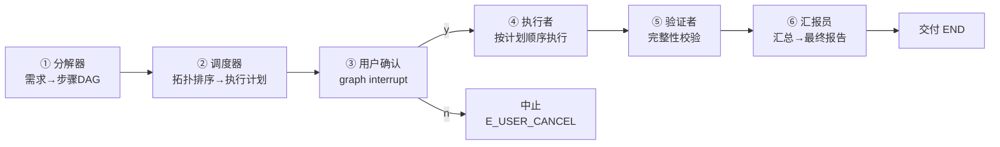

# Agent Builder · 最小闭环交付说明（v0.2）

> 本文档记录 Agent Builder 项目「需求 → 计划 → 用户确认 → 执行 → 验证 → 汇报」最小闭环的落地说明。
> 适用读者：项目维护者、协作者、评审者。

| 项目 | 内容 |
| --- | --- |
| 版本 | v0.2（最小闭环） |
| 日期 | 2026-09-26 |
| 仓库 | https://github.com/Litao-66-bit/li-tao-agent-builder |
| 许可 | MPL-2.0 |
| 技术栈 | Python 3.10+ · LangGraph 1.2 · DeepSeek API / Mock · Pydantic 2 |

---

## 1. 项目一句话

**Agent Builder 是一个"用 Agent 制作 Agent"的元 Agent 项目**：输入一句自然语言需求，系统自动完成需求分解、计划编排、用户确认、执行、验证与汇报，最终交付一个可运行的 Agent。

## 2. 最小闭环（v0.2）概述

闭环由 6 个角色节点串联，用户确认点是唯一的人工介入闸口：



| 节点 | 角色 | 处理 | 异常行为 |
| --- | --- | --- | --- |
| ① 分解器 | LLM | 需求 → 步骤 DAG（JSON） | 输出缺 steps / Schema 校验失败 → E_VALIDATION |
| ② 调度器 | 本地 | 按依赖稳定拓扑排序，产出执行计划 | 依赖环 → E_VALIDATION（兜底） |
| ③ 用户确认 | 人工 | graph interrupt 暂停，等待 y/n | n → E_USER_CANCEL 中止 |
| ④ 执行者 | LLM | 按 plan.order 逐步骤执行 | 单步失败向上抛异常 |
| ⑤ 验证者 | 本地 | 校验各步骤结果非空 | 空产出 → E_VALIDATION |
| ⑥ 汇报员 | LLM | 汇总各步结果，生成交付报告 | 空报告 → E_MODEL |

设计要点：

- **用户确认不可绕过**：确认点用 LangGraph `interrupt` 实现，第一次 invoke 停在确认点返回计划，`Command(resume=...)` 恢复；确认前 `plan.confirmed_by_user = False`，确认后置 True。
- **状态 JSON-safe**：图状态全部存普通 dict（checkpoint 可序列化），Pydantic Schema 校验收敛在节点内部，规避 LangGraph checkpointer 序列化限制。
- **可插拔模型层**：`LLMClient` 抽象 + `DeepSeekClient`（生产）/ `MockClient`（演示、确定性路由），同一接口 `chat_text` / `chat_json`。

## 3. 新增代码模块

最小闭环在既有契约层之上新增三个子包与一个 CLI 入口：

| 模块 | 文件 | 职责 |
| --- | --- | --- |
| 模型层 | `agent_builder/llm/client.py` | LLMClient 协议；DeepSeekClient（`base_url=https://api.deepseek.com`，model `deepseek-chat`，temperature 0.3）；MockClient（按"分解器/汇报员/执行者"角色名路由，确定性 JSON/文本） |
| 图编排 | `agent_builder/graph/state.py` | 图状态定义（task_id / requirement / steps / plan / results / report） |
| 图编排 | `agent_builder/graph/nodes.py` | 六个角色节点 + 角色提示词（分解器 / 执行者 / 汇报员） |
| 图编排 | `agent_builder/graph/build.py` | StateGraph 组装：decompose→schedule→confirm→execute→verify→summarize，MemorySaver 检查点 |
| 工具门卫 | `agent_builder/tools/gatekeeper.py` | 角色白名单（未注册即拒）；工具白名单（未列出即拒）；沙箱路径 realpath 校验；高风险工具（file_write 等）需用户审批；全部调用落审计日志 |
| CLI | `agent_builder/__main__.py` | `python -m agent_builder "需求" [--mock]`；读 `.env` 的 DEEPSEEK_API_KEY；交互确认 y/n |
| 测试 | `tests/test_graph.py` | 全图闭环 / 用户拒绝 / Mock 路由 / 门卫五类用例 |

### 安全边界（本轮已落地）

- **门卫是唯一执行出口**：一切工具调用必须先通过 `ToolGatekeeper.check()`。
- **权限矩阵**：`RolePerm` 声明 `allowed_tools` + `high_risk_tools`（高危必须是允许子集，未列出一律拒绝）。
- **沙箱**：file 类路径经 `realpath` 校验，必须落在工作区白名单内，越权（如 `/etc/passwd`）→ E_PERMISSION。
- **审批门**：高风险工具未获 `Approval(granted_by="user")` 一律拒绝。
- **密钥**：`DEEPSEEK_API_KEY` 只从 `.env` 读取，`.env*` 已被 `.gitignore` 排除，不入库。

## 4. 验证结果

| 检查项 | 结果 |
| --- | --- |
| Ruff | 0 告警（`ruff check .` 通过） |
| Pytest | 38/38 通过（30 契约层 + 8 图/门卫） |
| CLI 端到端（mock）· 确认分支 | 输入 y → 完整闭环 → 输出最终报告 |
| CLI 端到端（mock）· 拒绝分支 | 输入 n → 正常中止（E_USER_CANCEL） |
| 环境 | Python 3.12.11 · langgraph 1.2.12 · langchain-openai 1.6.6 · pydantic 2.13.5 |

## 5. 使用方式

```bash
# 演示模式（无需密钥，推荐先跑）
python -m agent_builder "帮我生成一个每日新闻摘要 Agent" --mock

# 生产模式（需在 .env 配置 DEEPSEEK_API_KEY）
cp .env.example .env   # 填入密钥
python -m agent_builder "帮我生成一个每日新闻摘要 Agent"
```

运行流程：CLI 打印执行计划 → 等待输入 `y`（继续）或 `n`（中止）→ 输出最终交付报告。

## 6. 仓库与推送状态

| 项目 | 状态 |
| --- | --- |
| GitHub 仓库 | 已公开 · main 默认分支 · CI run #1 成功 |
| 本地 git | 4 个提交：`5cf2c6f`（已推送）→ `b1e05ca`（契约层）→ `aade25f`（忽略临时文件）→ `dea7e38`（最小闭环） |
| 待推送 | `b1e05ca` / `aade25f` / `dea7e38` 三个提交尚未推送到 GitHub |
| 推送方式 | 在 Windows 端 `cd C:\Users\李陶\li-tao-agent-builder && git push origin main` |

## 7. 下一步建议（三选一）

1. **接入真实工具**：把 `web_search` / `file_write` 等工具挂到执行者，让 Agent 真正"做事"（全过门卫 + 审批）。
2. **副架构治理门**：把 `ChangeProposal` 变更审批流接入副架构（审计员 → 方案生成者 → 影响分析者 → 看门人 → 记录员）。
3. **跑通真实 DeepSeek 闭环**：配置密钥后实测生产链路，验证真实模型输出下的 Schema 鲁棒性。
